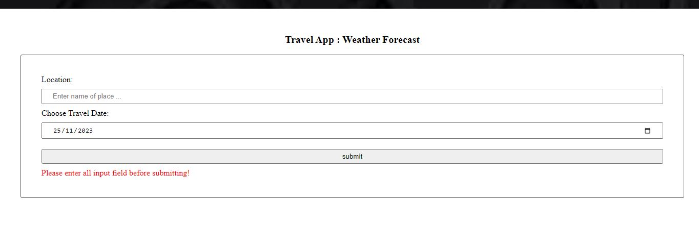
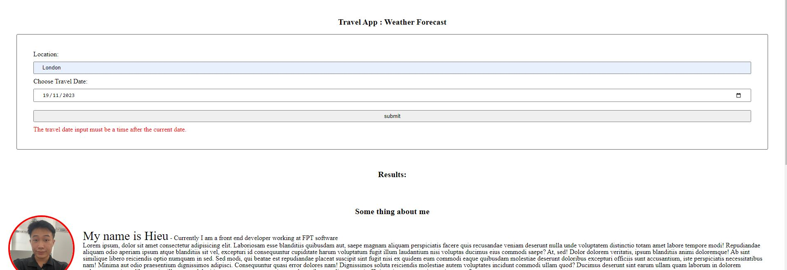
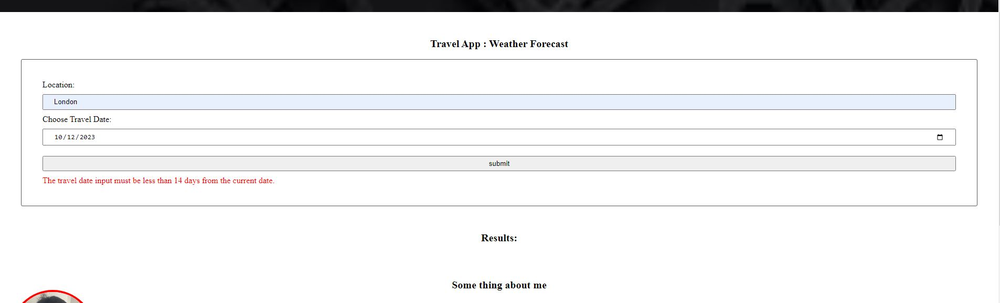
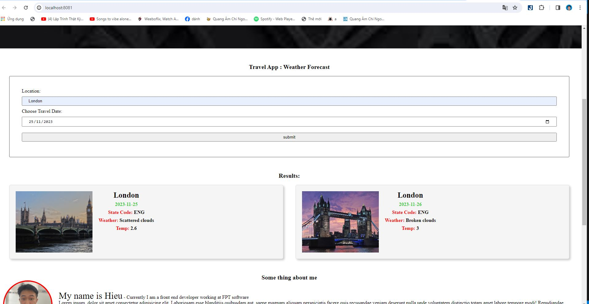

# Project Instructions

This project requires you to build out a travel app that, at a minimum, obtains a desired trip location & date from the user, and displays weather and an image of the location using information obtained from external APIs. Given that this is the Capstone project, it's highly encouraged for you to go above and beyond, adding additional functionality and customization to truly stand out with a project you are proud to have at the top of your portfolio!

## Getting started

Remember that once you run project, you will still need to install everything:

`cd` into your new folder and run:

- `npm install`

## Run project

### Step 1: Build Project Ver Product

Type the syntax `npm run build-prod` into the terminal and press enter

### Step 2: Run server

Type the syntax `npm start` into the terminal and press enter

### Step 3: Build Project Ver Dev

Type the syntax `npm run build-dev` into the terminal and press enter

## Start Evaluate a new article with natural language processing

Enter the location in the location input box and travel date to date input box then press submit,then 4 cases will happen:

- InValid input :
  error 1:
  
  error 2:
  
  error 3:
  

- Valid input and success call api
  
